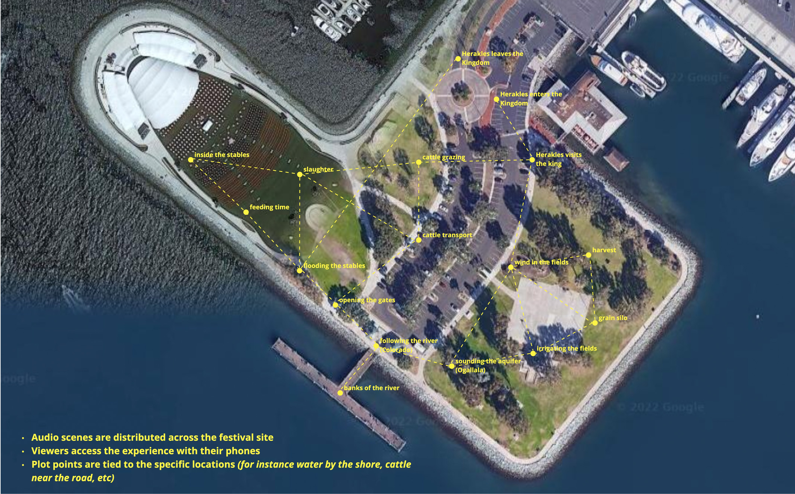
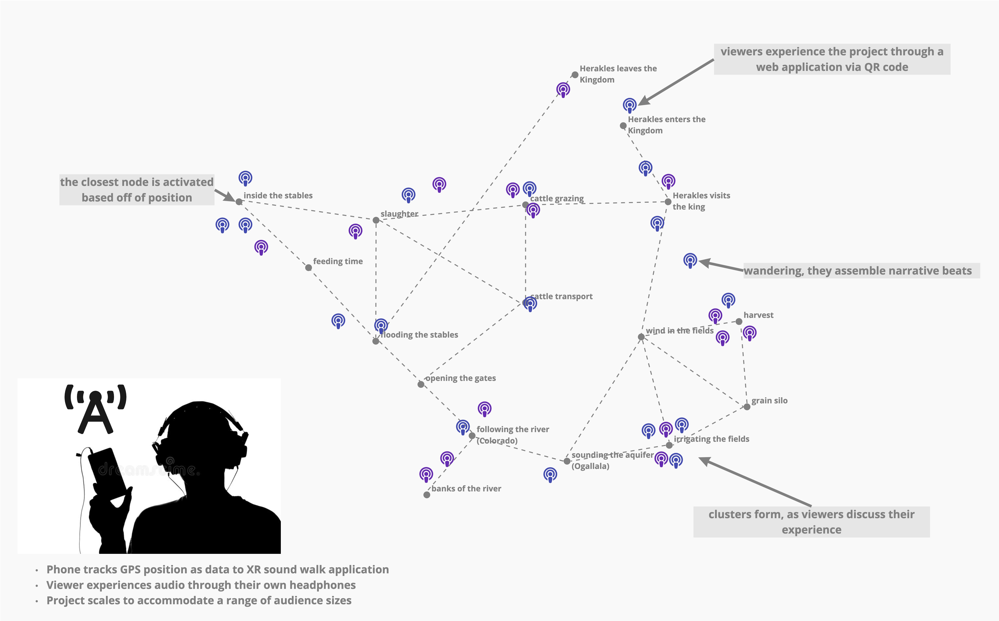

# Description

This project, one chapter from the Herakles Project, adapts his 5th labor as an immersive soundwalk, reimagining Euripedes story as an individualized XR audio experience with accompanying visuals experienced through viewers’ smartphones and headsets. Working from field recordings and photogrammetric models documenting the distinct features of Nebraskan and Southern Californian agriculture and aquaculture—this project surfaces structural similarities and illuminates parallel concerns in the twin Breadbaskets of the American midwest and southwest. It juxtaposes approaches to precision agriculture, cattle operations, and water rights management in these distinct geographic regions.

Mapped over the site of the Rady Shell, the listener explores a speculative future of geoengineering gone wrong as a locative media project, navigating the narrative space of the piece overtop of the physical space of the festival. Herakles is recast as an agricultural robot; water is scarce, sourced from the dwindling Ogollala aquifer and Colorado River; ”the moving sand dune” of the midwest has joined its brethren on the western coast; and we are left to reconcile the real costs and possible futures of livestock, agriculture, and scarcity in a changing environment.

The Herakles Project adapts Euripedes 12 Labors as a series of interlinked XR/AI/VR pieces. The project surfaces the existential question of motive–whether the labors were a form of expiation for the murder of his wife and children, or were they the cause of post-traumatic stress - violence begetting violence - that induced the murder of his family? These questions take on new significance in a contemporary frame.

# Site Map

# Technical Details

This project is geolocative sound walk, facilitated through viewers own smartphones and headsets. The narrative space of the project is mapped over the physical space of site. For the WoW Festival 2023, our sonic episodes will be distributed across the space surrounding the Rady Shell. 

<!-- # Visitor Experience
[TK]

# Tools and Resources
[TK]
-->
# References
- [Budget](https://docs.google.com/spreadsheets/d/1nkKvQrZhyey3IujSvX8kp7EB51x0W7flmHE_1kr9U10/edit?usp=sharing)
- [Timeline]()

# Team
Precise Device is an extended theater collaborative creating spatial narratives, speculative futures, and immersive and augmented realities. Our projects exist in the real world, engaged with the sites where we work, live, and play.

**[Robert Twomey](https://roberttwomey.com)** - Scholar in Residence, INKWell Collective (UCSD) and [Arthur C. Clarke Center for Human Imagination](https://imagination.ucsd.edu) (UCSD). Assistant Professor at the Johnny Carson Center of Emerging Media Arts, UNL. 

**[Ash Smith](https://asheveryday.com/)** - UCSD Design Lab Affiliate. Assistant Professor at the Johnny Carson Center of Emerging Media Arts, UNL.

Recent work: **AI Radio Play**: [radio-play.net](radio-play.net)
