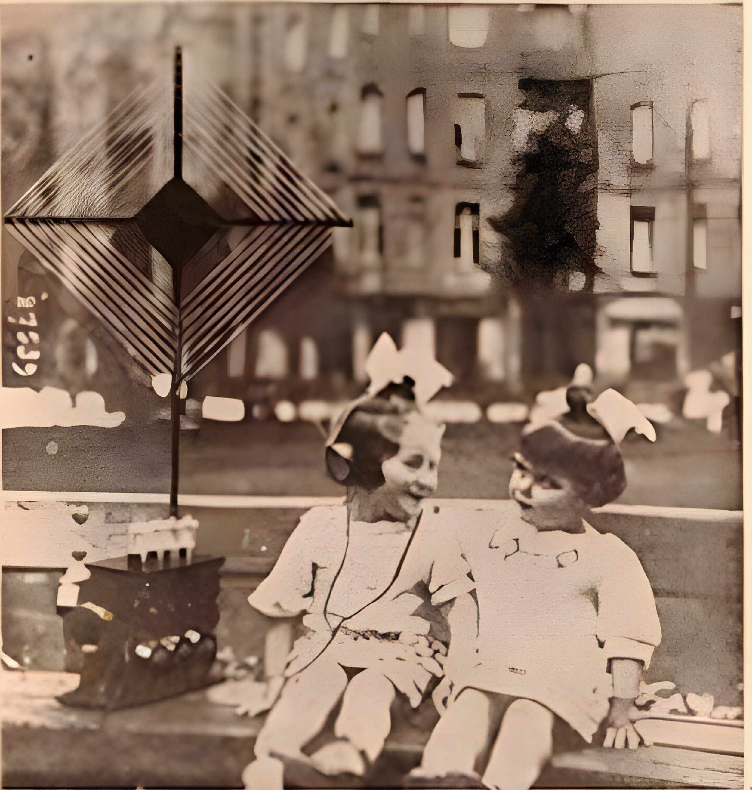

A workshop for [ISEA2022 Possibles](https://isea2022.isea-international.org/). June 11, 10-6pm CEST. [CCCB, Aula 1](https://www.cccb.org/es/servicios/alquiler-de-espacios/aula-1/9738)

<!-- <h1><a href="https://s3.radio.co/s70d0dcdd7/listen" target="_blank"><<< LISTEN LIVE >>></a></h1> 5-5:30 CEST/1500-1530 GMT
-->

<h1><<< LISTEN LIVE >>></h1> 5-5:30 CEST/1500-1530 GMT June 11

[recording](https://drive.google.com/file/d/17tCo1KDt7q485hBkwBPB1XM5c5xY1d2c/)

# Description

An immersive soundwalk, this labor is reimagined as an individualized XR audio piece with accompanying visuals, experienced through viewers’ smartphones and headsets. Working from field recordings and photogrammetric models documenting the distinct features of Nebraskan and Southern Californian agriculture and aquaculture—this project surfaces structural similarities and illuminates parallel concerns in the twin Breadbaskets of the American midwest and southwest. It juxtaposes approaches to precision agriculture, cattle operations, and water rights management in these distinct geographic regions.

Mapped over the site of the Rady Shell, the listener explores a speculative future of geoengineering gone wrong as a locative media project, navigating the narrative space of the piece overtop of the physical space of the show. Herakles is recast as an agricultural robot; water is scarce, sourced from the dwindling Ogollala aquifer and Colorado River; ”the moving sand dune” of the midwest has joined it’s brethren on the western coast; and we are left to reconcile the real costs and possible futures of livestock, agriculture, and scarcity in a contemporary Western frame.

# Technical Details

This project is geolocative sound walk, facilitated through our mobile sound devices. The narrative space of the project is mapped over the physical space of site. For the WoW Festival 2023, our sonic episodes will be distributed across the space surrounding the Rady Shell. 

https://images-ext-1.discordapp.net/external/d4tL0LMjfGfyNcwiaZd0toZ2AdHnOxTnB33gzXTELM8/https/lajollaplayhouse.org/wowfestival2022/wp-content/uploads/Embarcadero-Marina-Park-South-Map-pdf-1200x927.jpg

# Visitor Experience
[TK]

# Tools and Resources
[TK]

# References
[TK]

# Team
**Robert Twomey** - Scholar in Residence, INKWell Collective (UCSD). Director of [Machine Cohabitation Lab](http://cohab-lab.net) UNL - [roberttwomey.com](https://roberttwomey.com) 
**Ash Smith** - UCSD Design Lab Affiliate. Story, Worlds, Speculative Design Lab, UNL - [asheveryday.com](https://asheveryday.com/) 
